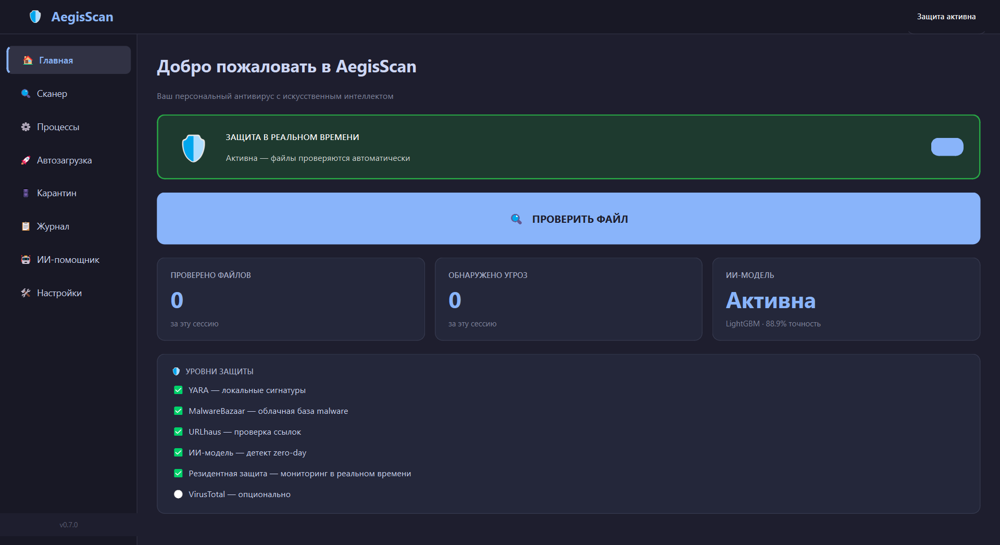
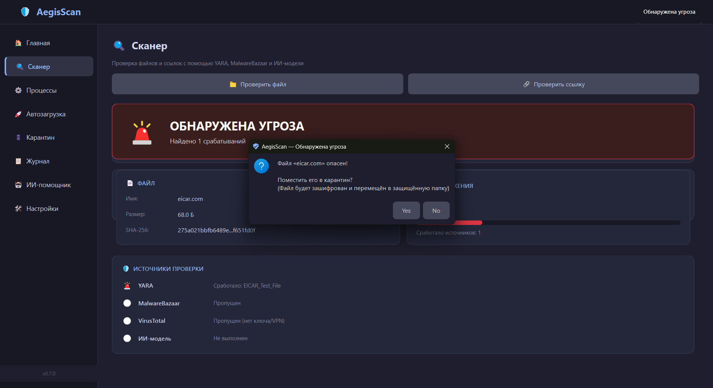
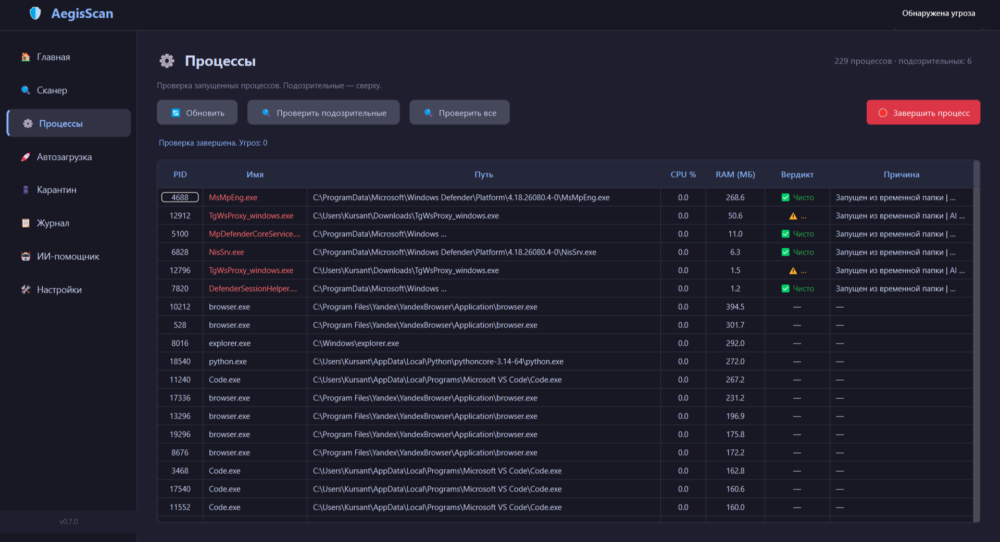
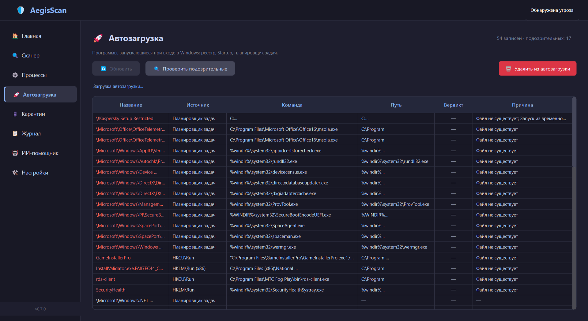
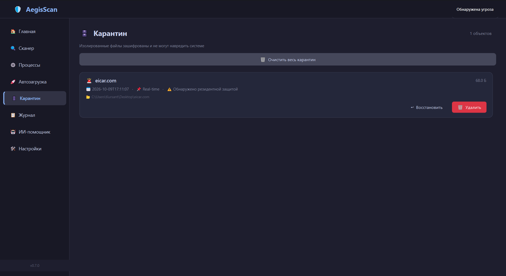
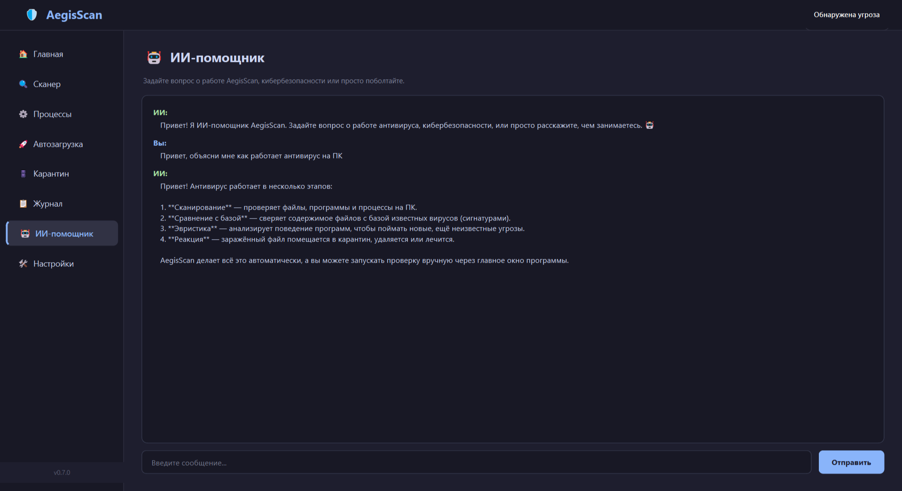

# 🛡 AegisScan

**Кроссплатформенный антивирус с искусственным интеллектом для Windows**


---

## 📖 О проекте

AegisScan — учебный проект, созданный учеником **8 класса**.
Демонстрирует полный цикл разработки антивируса: от сигнатурного анализа
до ИИ-модели для обнаружения zero-day угроз.

### Возможности

- 🔍 **Сканер файлов** — YARA-сигнатуры + MalwareBazaar + ИИ-модель
- 🛡 **Резидентная защита** — мониторинг файловой системы в реальном времени
- ⚙️ **Сканер процессов** — обнаружение подозрительных процессов
- 🚀 **Сканер автозагрузки** — реестр, Startup, планировщик задач
- 🗄️ **Карантин** — шифрование изолированных файлов (Fernet)
- 📋 **Журнал событий** — SQLite с экспортом в CSV
- 🤖 **ИИ-помощник** — чат на DeepSeek для консультаций
- 🎨 **Тёмная тема** — GUI на PyQt6 в стиле Kaspersky

---

## 🛠 Технологии

- **Язык:** Python 3.14
- **GUI:** PyQt6
- **ИИ:** LightGBM (18 статических признаков PE-файлов)
- **Сигнатуры:** YARA
- **Облачные базы:** MalwareBazaar, URLhaus (abuse.ch)
- **Безопасность:** cryptography (Fernet), hashlib
- **Мониторинг:** watchdog, psutil, pefile
- **Сборка:** PyInstaller

---

## 📊 Метрики ИИ-модели

| Метрика | Значение |
|---|---|
| Accuracy | 0.89 |
| Precision | 0.75 |
| Recall | 0.86 |
| F1-score | 0.80 |
| Обучающая выборка | 134 PE-файла |

---

## 🚀 Установка

### Для пользователей

1. Скачай `AegisScan.exe` из [Releases](../../releases)
2. Создай рядом файл `.env`:

```
ABUSECH_AUTH_KEY=твой_ключ_с_auth.abuse.ch
DEEPSEEK_API_KEY=твой_ключ_с_platform.deepseek.com
VT_API_KEY=
```

3. Запусти `AegisScan.exe`

### Для разработчиков

```bash
git clone https://github.com/karpik67/AegisScan.git
cd AegisScan
pip install -r requirements.txt
python main.py
```

---

## 📸 Скриншоты

### Главная


### Сканер


### Процессы


### Автозагрузка


### Карантин


### ИИ-помощник


---

## 🗺 Roadmap

- [x] Сканер файлов (YARA + ML)
- [x] Резидентная защита
- [x] Сканер процессов
- [x] Сканер автозагрузки
- [x] Карантин с шифрованием
- [x] Журнал событий
- [ ] Сканер сетевых соединений
- [ ] Сканер браузеров
- [ ] Полное сканирование дисков
- [ ] Обучение на 1000+ образцов
- [ ] Мобильная версия

---

## 📄 Лицензия

MIT License — используй свободно.

---

## 👤 Автор

**Ученик 8 класса.** Проект создан в образовательных целях.

- GitHub: [@karpik67](https://github.com/karpik67)